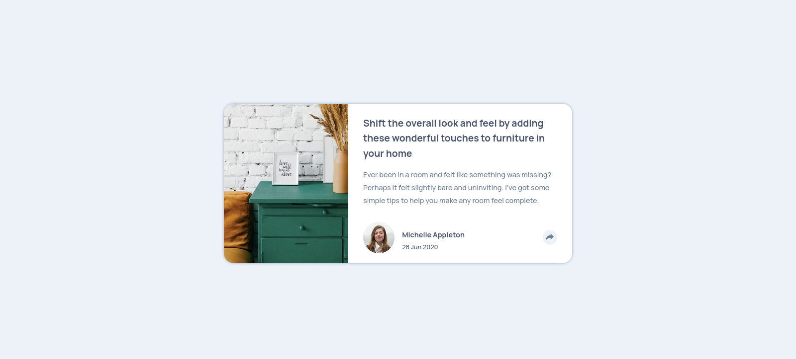
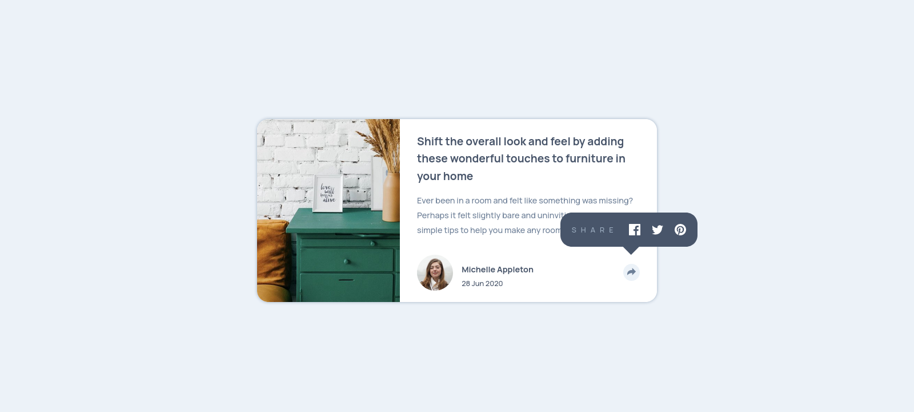
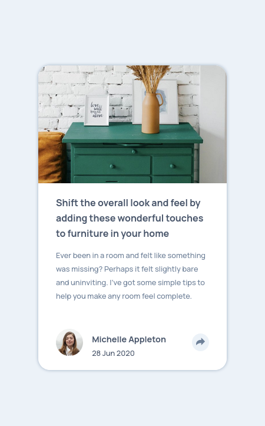
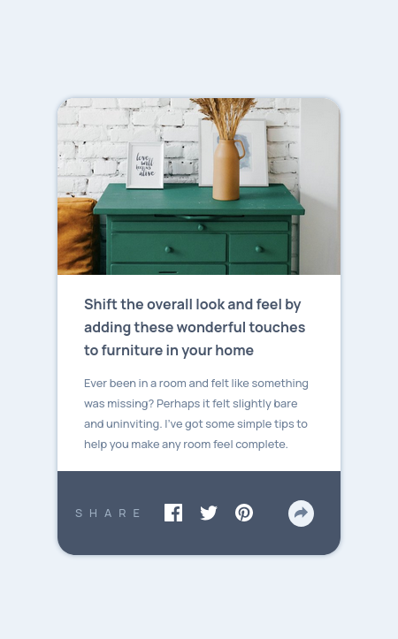

# Frontend Mentor - Article preview component solution

This is a solution to the [Article preview component challenge on Frontend Mentor](https://www.frontendmentor.io/challenges/article-preview-component-dYBN_pYFT). Frontend Mentor challenges help you improve your coding skills by building realistic projects.

## Table of contents

-   [Overview](#overview)
-   [The challenge](#the-challenge)
-   [Screenshot](#screenshot)
-   [Links](#links)
-   [Built with](#built-with)
-   [Author](#author)

## Overview

Fully Responsive Article Preview Card Component Using HTML , CSS and JS

### The challenge

Users should be able to:

-   View the optimal layout for the component depending on their device's screen size
-   See the social media share links when they click the share icon

### Screenshot

### Links

-   Solution URL: [Github Repo](https://github.com/AhmedLebda/Frontend-Mentor-article-preview-card.git)
-   Live Site URL: [live site](https://ahmedlebda.github.io/Frontend-Mentor-article-preview-card/)

### Built with

-   Mobile-first workflow
-   Semantic HTML5 markup
-   CSS custom properties
-   Flexbox
-   CSS Grid

## Author

-   Github - [Ahmed Lebda](https://github.com/AhmedLebda)
